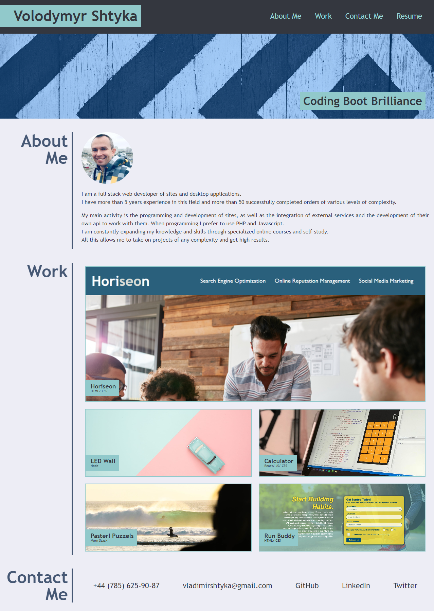

# Volodymyr Shtyka // Web Developer

## Project Overview
This repository showcases the work of Volodymyr Shtyka, a web developer. It includes an introduction, portfolio, and contact information.

## Preview

## Link to the deployed application
[https://volodymyr-shtyka.github.io/web-developer-profile](https://volodymyr-shtyka.github.io/web-developer-profile)

## Installation Instructions
To view this project locally, follow these steps:
1. Clone the repository: `git clone git@github.com:Volodymyr-Shtyka/module-2-challenge.git`
2. Navigate to the project directory: `cd module-2-challenge`
3. Open the `index.html` file in your web browser.

## Usage Guide
Explore the portfolio by navigating through the sections:
- **About Me:** Learn more about Volodymyr Shtyka.
- **Work:** Check out various web development projects.
- **Contact Me:** Find ways to get in touch.

## Configuration
This project doesn't require specific configuration. However, feel free to customize the content or styling to suit your preferences.

## Contributing Guidelines
Contributions to this project are not currently accepted. If you have suggestions or find issues, please [create an issue](https://github.com/Volodymyr-Shtyka/web-developer-portfolio/issues).

## License
This project is licensed under the [MIT License](LICENSE).

## Formatting Tips
- Use headings to structure your content.
- Utilize bullet points and numbered lists for clarity.
- Embed images, GIFs, or videos to enhance understanding.
- Include links to related resources, documentation, or external websites.